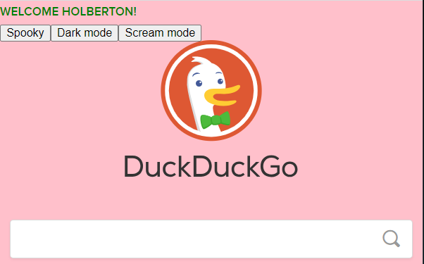

# Javascript advanced

## Description

JavaScript is a very function-oriented language. A function can be created at any moment, passed as an argument to another function, and then called from a totally different place of code later. To understand how JavaScript functions behave in different scenarios, the following concepts and technologies are explored in this project:
* What is lexical scope in JavaScript?
* What is closure in JavaScript?
* How to use the closure
* How to chain different closures
* How to mock private methods with closure
* The order of stack execution with JavaScript
* How to use binding
* How to use callbacks

---

### [0. Lexical scoping and welcome message](./0-welcome.js)

JavaScript supports nested functions. Nested functions have access to the scope "above" them.

* Create a nested function that access an outer variable (concatenated string from two parameters of outer function). 

* Running the script display a popup alert with the message:
Welcome + outer variable + and exclamation mark

### [1. Closure Scope Chain](./1-nested_functions.js)

A closure gives you access to an outer function's scope from an inner function. In JavaScript, closures are created every time a function is created, at function creation time, we can say that closures have access to all outer function scopes.

Every closure has three scopes:
Local scope (Own scope)
Enclosing scope (can be block, function, or module scope)
Global scope

The outer function is itself a nested function, access to the outer function's scope includes the enclosing scope of the outer function—effectively creating a chain of function scopes.

* Create three level nested functions and call each of them from one level outer. Each function adds one level outer variable (string) to a concatenated alert message and a new local variable (string).

* Running the script display trhee popups alerts one by one with the text Welcome, Welcome Holberton, and Welcome Holberton!

### [2. Closure](./2-function_me.js)

Closures are useful because they let you associate data (the lexical environment) with a function that operates on that data. Then, you can use a closure anywhere that you might normally use an object with only a single method. A closure is the combination of a function and the lexical environment within which that function was declared. This environment consists of any local variables that were in-scope at the time the closure was created.  Variables defined as a call of the same function, but with different arguments, are (functions) closures sharing the same function body but storing different lexical environments.

* Write a function that displays an alert message: Welcome + argument. Then declare three variables, each one calls the function with a different argument ("Guillaume", "Alex", "Fred").

* Running the script display three popups alerts one by one with the texts Welcome Guillaume, Welcome Alex and Welcome Fred

### [3. Closure and loops](./3-classrooms.js)

It's important to understand that we can create several closures with a loop, but each one shares the same single lexical environment, which has a variable with changing values. 

When closures are created inside a loop in JavaScript, they can exhibit unexpected behavior due to the way closures capture variables. The issue arises because closures capture variables by reference, not by value. This means that all the closures created in the loop will reference the same variable, which will have the value it had at the end of the loop.

To overcome this issue, you can create a new scope for each iteration of the loop. One common approach is to use an immediately-invoked function expression (IIFE) to create a new scope.

* Write a function that returns an array of functions and display calls of different elements (functions) of the array.

### [4. Complex Closure](./4-math.js)

* Create a function addBy() that takes a single argument x, and returns an anonymous function. The function it returns takes a single argument y, and returns the sum of x and y.

* Create a function divideBy() that takes a single argument x, returns an anonymous function. The function it returns takes a single argument y, and returns the division of x by y.

* Use addBy() as a function factory, by forming closures where x (lexical environment) is 100 and 1000. Test both closures when y is 20. Should display in the console: 120 and 1020.

* Use divideBy() as a function factory, by forming closures where x (lexical environment) is 10 and 100. Test both closures when y is 20 and 200 respectively. Should display in the console: 2 and 2.

### [5. Changing DOM with closure](./5-mode.js)

The Document Object Model (DOM) is the data representation of the objects that comprise the structure and content of a document on the web. The Document Object Model (DOM) is a programming interface for web documents, that represents the page as nodes and objects so that programs can change the document structure, style, and content. The DOM was designed to be independent of any particular programming language, making the structural representation of the document available from a single, consistent API. Even if most web developers will only use the DOM through JavaScript, implementations of the DOM can be built for any language.

* Create and return a function that, when called, will update the styling of the document.body element based on the provided parameters (values) for size, weight, transform, background, and color.

* Create a function that create a paragraph and three buttons included in a html document. Inside this function include three closures of the previous function with different parameters values. When clicked each button apply a different style (closure) to the html document.

To use vanilla JavaScript, you simply write JavaScript code without relying on any additional libraries or frameworks. Vanilla JavaScript refers to using pure, plain JavaScript to accomplish tasks without the need for external dependencies. Start by creating an HTML file and include a script tag, where you'll write your JavaScript code.

* Test the the code using vanilla JavaScript.

    
    
  

* Alternatively, we can test our code as a snippet in dev tools.

  

### [6. Private methods with closure](./6-hogwarts.js)

Private methods and variables in JavaScript are accessible only within a specific scope, such as within a class or an object.
The public API (Application Programming Interface) of a class or module refers to the set of public methods, properties, and other elements that are intended to be used by external code.

To use a module and closures to keep variables and methods private while accessing them through public methods in JavaScript, we can follow the Module Pattern. 

The module is defined as an immediately invoked function expression (IIFE). The private variables and functions are defined within the scope of the IIFE and are inaccessible from outside.

The module returns an object with the public methods. These public methods have access to the private variables and functions due to closures. By creating an instance of the module, we can access the public methods of the module through the instance. This allows us to indirectly access the private methods as well.

* Create a module named studentHogwarts. The module contains two private variables (name and score) and a private method (changeScoreBy). Then return an object that contain four public methods (setName, rewardStudent, penalizeStudent and getScore).

* Create two instances of the module studentHogwarts and apply public methods.

### [7. Stack order and setTimeout](./7-timeout.js)

The window object allows execution of code at specified time intervals. These time intervals are called timing events. The setTimeout(function, milliseconds) method, executes a function, after waiting a specified number of milliseconds.

* Log to the console a Start message
* Log to the console a  Delayed message using stTimeout method with delay time of 0
* Print numbers from 1 to 100 to the console, using a for loop
* Log to the console an End of Loop message
* Test that the Delayed message is the last one to be printed because all synchronous code is executed first before processing any tasks in the event queue.

### [8. Stack order in functions](./8-payments.js)

* Write functions that call other functions inside them, to understand the stack order in functions.

### [9. Prime numbers & timing execution](./9-prime.js)

The performance.now() method returns a high resolution timestamp in milliseconds.

* Create a function that returns the number of prime numbers from 2 to 100. Then use performance.now() to estimate the time to run the function.

### [10. Execution stack & timing execution](./10-prime.js)

* Reuse the function countPrimeNumbers from 9-prime.js (copy/paste) and estimate the time to run the function 100 times.

### [11. Changing stack order using setTimeout](./11-prime.js)

Using setTimeout() multiple times with a delay of 0 milliseconds allows the callbacks to be added to the event queue in the order they are called.

* Reuse the function countPrimeNumbers from 10-prime.js (copy/paste), and call it 100 times by using setTimeout(countPrimeNumbers, 0). Calculate the time to execute the code.

### [12. Binding](./12-room_area.js)

With the bind() method, an object can borrow a method from another object.

* Create an object named roomDimensions with one method, also create a variable and bind the method and the variable.

### [13. Binding + Closure](./13-bind_user.js)
Sometimes the bind() method has to be used to prevent losing this.  When a function is used as a callback, this is lost. The bind() method solves this problem.

* Create an object user with properties and create a function that use properties of the object using this. Create a variable that bind the function to the object, to prevent the losing of this.

### [14. Simple callback](./14-wikipedia.js)

All modern browsers support the XMLHttpRequest object.  The XMLHttpRequest object can be used to exchange data with a server behind the scenes. This enables a Web page to update just part of a page without disrupting what the user is doing. Despite its name, XMLHttpRequest can be used to retrieve any type of data, not just XML. Syntax for creating an XMLHttpRequest object:
variable = new XMLHttpRequest();

To send a request to a server, we use the open() and send() methods of the XMLHttpRequest object.

The open() method specifies the type of request
xhttp.open("GET", "ajax_info.txt", true);
where, method: the type of request: GET or POST, url: the server (file) location and async: true (asynchronous) or false (synchronous). By sending asynchronously, the JavaScript does not have to wait for the server response, but can instead: execute other scripts while waiting for server response or deal with the response after the response is ready.

The send() method sends the request to the server (used for GET).

When deciding which method to use, remember that GET is simpler and faster than POST, and can be used in most cases.

The XMLHttpRequest() constructor creates a new XMLHttpRequest. It must be called before any other method calls.

* Create a function for making a request to the Wikipedia API and retrieving the article content for the Stack Overflow page.

* Test the code using vanilla javascript

    

### [15. Multiple callbacks](./100-stock.js)

* Create a variable named stock:

---

## Author

**Claudia Perez** - [21Kgold](https://github.com/21Kgold)