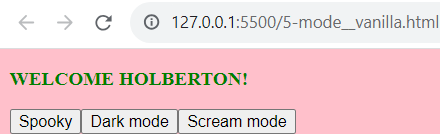
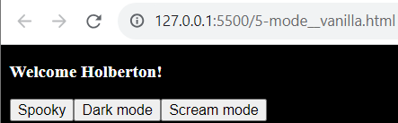
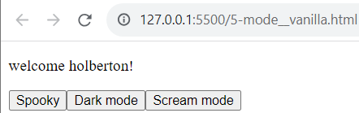

# Javascript advanced

## Description

JavaScript is a very function-oriented language. A function can be created at any moment, passed as an argument to another function, and then called from a totally different place of code later. To understand how JavaScript functions behave in different scenarios, the following concepts and technologies are explored in this project:
* What is lexical scope in JavaScript?
* What is closure in JavaScript?
* How to use the closure
* How to chain different closures
* How to mock private methods with closure
* The order of stack execution with JavaScript
* How to use binding
* How to use callbacks

---

### [0. Lexical scoping and welcome message](./0-welcome.js)

JavaScript supports nested functions. Nested functions have access to the scope "above" them.

* Create a nested function that access a outer variable (concatenated string from two parameters of outer function). 

* Running the script display a popup alert with the message:
Welcome + outer variable + and exclamation mark

### [1. Closure Scope Chain](./1-nested_functions.js)

A closure gives you access to an outer function's scope from an inner function. In JavaScript, closures are created every time a function is created, at function creation time, we can say that closures have access to all outer function scopes.

Every closure has three scopes:
Local scope (Own scope)
Enclosing scope (can be block, function, or module scope)
Global scope

The outer function is itself a nested function, access to the outer function's scope includes the enclosing scope of the outer function—effectively creating a chain of function scopes.

* Create three level nested functions and call each of them from one level outer. Each function adds one level outer variable (string) to a concatenated alert message and a new local variable (string).

* Running the script display trhee popups alerts one by one with the text Welcome, Welcome Holberton, and Welcome Holberton!

### [2. Closure](./2-function_me.js)

Closures are useful because they let you associate data (the lexical environment) with a function that operates on that data. Then, you can use a closure anywhere that you might normally use an object with only a single method. A closure is the combination of a function and the lexical environment within which that function was declared. This environment consists of any local variables that were in-scope at the time the closure was created.  Variables defined as a call of the same function, but with different arguments, are (functions) closures sharing the same function body but storing different lexical environments.

* Write a function that displays an alert message: Welcome + argument. Then declare three variables, each one calls the function with a different argument ("Guillaume", "Alex", "Fred").

* Running the script display trhee popups alerts one by one with the texts Welcome Guillaume, Welcome Alex and Welcome Fred

### [3. Closure and loops](./3-classrooms.js)

It's important to understand that we can create several closures with a loop, but each one shares the same single lexical environment, which has a variable with changing values. 

When closures are created inside a loop in JavaScript, they can exhibit unexpected behavior due to the way closures capture variables. The issue arises because closures capture variables by reference, not by value. This means that all the closures created in the loop will reference the same variable, which will have the value it had at the end of the loop.

To overcome this issue, you can create a new scope for each iteration of the loop. One common approach is to use an immediately-invoked function expression (IIFE) to create a new scope.

* Write a function that returns an array of functions and display calls of differents elements (functions) of the array.

### [4. Complex Closure](./4-math.js)

* Create a function addBy() that takes a single argument x, and returns an anonymous function. The function it returns takes a single argument y, and returns the sum of x and y.

* Create a function divideBy() that takes a single argument x, returns an anonymous function. The function it returns takes a single argument y, and returns the divisioon of x by y.

* Use addBy() as a function factory, by forming closures where x (lexical environment) is 100 and 1000. Test both closures when y is 20. Should display in the console: 120 and 1020.

* Use divideBy() as a function factory, by forming closures where x (lexical environment) is 10 and 100. Test both closures when y is 20 and 200 respectivily. Should display in the console: 2 and 2.

### [5. Changing DOM with closure](./5-mode.js)

The Document Object Model (DOM) is the data representation of the objects that comprise the structure and content of a document on the web. The Document Object Model (DOM) is a programming interface for web documents, that represents the page as nodes and objects so that programs can change the document structure, style, and content. The DOM was designed to be independent of any particular programming language, making the structural representation of the document available from a single, consistent API. Even if most web developers will only use the DOM through JavaScript, implementations of the DOM can be built for any language.

* Create and return a function that, when called, will update the styling of the document.body element based on the provided parameters (values) for size, weight, transform, background, and color.

* Create a function that create a pharagraph and three buttons included in a html document. Inside this function include three closures of the previus function whith different parameters values. When clicked each button apply a different style (closure) to the html document.

To use vanilla JavaScript, you simply write JavaScript code without relying on any additional libraries or frameworks. Vanilla JavaScript refers to using pure, plain JavaScript to accomplish tasks without the need for external dependencies. Start by creating an HTML file and include a script tag, where you'll write your JavaScript code.

* Test the the code using vanilla JavaScript.

  

  

  

---

## Author

**Claudia Perez** - [21Kgold](https://github.com/21Kgold)